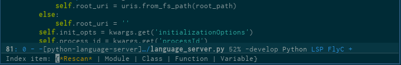
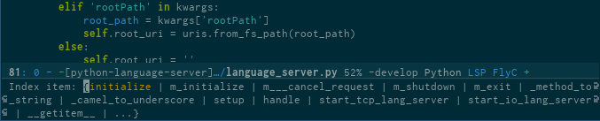
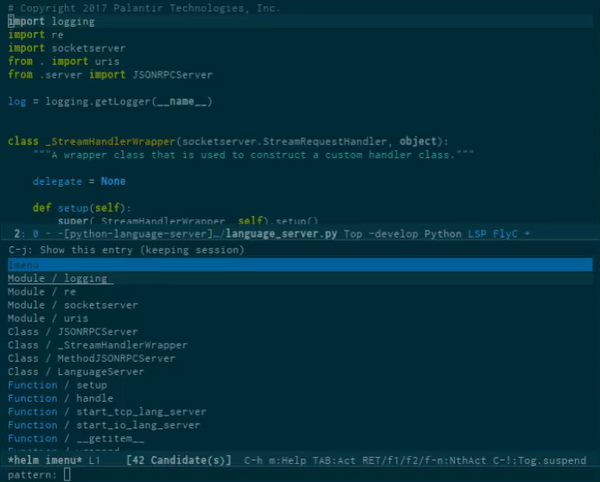

emacs-lsp
=========

[](https://gitter.im/emacs-lsp/lsp-mode?utm_source=badge&utm_medium=badge&utm_campaign=pr-badge&utm_content=badge)

[](https://travis-ci.org/emacs-lsp/lsp-mode)
[](http://melpa.org/#/lsp-mode)

A Emacs Lisp library for implementing clients for servers using Microsoft's
[Language Server Protocol](https://github.com/Microsoft/language-server-protocol/) (v3.0).

The library is designed to integrate with existing Emacs IDE frameworks
(completion-at-point, xref (beginning with Emacs 25.1), flycheck, etc).

*This package is still under development, and is not recommended for daily use.*
## Installation

Clone this repository to a suitable path, and add

```emacs-lisp
(add-to-list 'load-path "<path to emacs-lsp>")
(with-eval-after-load 'lsp-mode
    (require 'lsp-flycheck))
(require 'lsp-mode)

(lsp-define-stdio-client
 ;; This can be a symbol of your choosing. It will be used as a the
 ;; prefix for a dynamically generated function "-enable"; in this
 ;; case: lsp-prog-major-mode-enable
 lsp-prog-major-mode
 "language-id"
 ;; This will be used to report a project's root directory to the LSP
 ;; server.
 (lambda () default-directory)
 ;; This is the command to start the LSP server. It may either be a
 ;; string containing the path of the command, or a list wherein the
 ;; car is a string containing the path of the command, and the cdr
 ;; are arguments to that command.
 '("/my/lsp/server" "and" "args"))

;; Here we'll add the function that was dynamically generated by the
;; call to lsp-define-stdio-client to the major-mode hook of the
;; language we want to run it under.
;;
;; This function will turn lsp-mode on and call the command given to
;; start the LSP server.
(add-hook 'prog-major-mode #'lsp-prog-major-mode-enable)
```
to your .emacs, where `prog-major-mode` is the hook variable for a supported
programming language major mode.

## Adding support for languages
See [API docs](./doc/API.org)

## Examples

### completion
Completion is provided with the native `completion-at-point` (<kbd>C</kbd>-<kbd>M</kbd>-<kbd>i</kbd>),
 and should therefore work with any other completion backend. Async completion is provided by
 [company-lsp](https://github.com/tigersoldier/company-lsp).


### `eldoc` (Help on hover)
Hover support is provided with `eldoc`, which should be enabled automatically.


### Goto definition
Use <kbd>M</kbd> - <kbd>.</kbd> (`xref-find-definition`)
to find the definition for the symbol under point.


### Symbol references
Use <kbd>M</kbd> - <kbd>?</kbd> (`xref-find-references`)
to find the references to the symbol under point.


### Symbol Highlighting


### Flycheck


### Imenu



#### With [helm-imenu](https://github.com/emacs-helm/helm)



## Finer Control of Starting lsp-mode

In order to more finely control the `lsp-mode` startup, there are a number of
customizable variables.

`lsp-project-whitelist` : Defaults to `nil`. If set, `lsp-mode` will only be
started if the given project root appears in the whitelist.

`lsp-project-blacklist` : Defaults to `nil`. If set, all projects will be
started except those in this list. It is ignored if `lsp-project-whitelist` is
set.

There are also the functions `lsp-MAJOR-MODE-whitelist-add` and
`lsp-MAJOR-MODE-whitelist-remove` to adjust the current buffer project root
entry on the whitelist.

