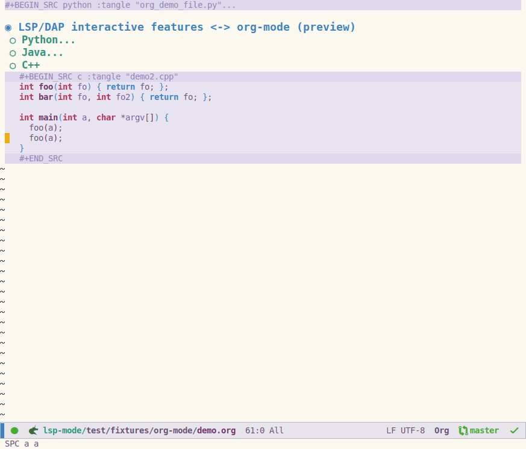

# Literate programming using LSP and org-mode(alpha)
`lsp-mode` provides **experimental** support for running the language servers
inside of [org-mode](https://orgmode.org/) source blocks. `lsp-mode` is
achieving this by obtaining the information about the source block from the
source block header(language + `:tangle`) then translating the point to the LSP
positions back and forth so the language server thinks that Emacs has opened the
original file. In order that to work the files has to be present on the disk as
well because the server expects to find them.

Here it is a sample source block:

``` org
#+BEGIN_SRC python :tangle "python.py"
print "Hello!"
#+END_SRC
```

## Demo


## Commands
* `lsp-org` start `lsp-mode` in source buffer. Must be executed with cursor
  being source block.
* `lsp-virtual-buffer-disconnect` turn off `lsp-mode`.

## What works
* `lsp-mode` core features (finding references, going to definitions, completion, lenses, highlighting, etc)
* `company-mode`
* `flycheck`
* `lsp-treemacs-symbols`
* `lsp-treemacs-errors-list`

## Known limitations
* Incremental updates are performed by sending the whole
  buffer each time(they simulate full updates).
* Deleting content that spans across the source block and the content of the org
  document is not handled.
* Opening and editing the actual file from the disk might cause undefined
  behaviour because the server expects file to be open only once.

## What does not work
* `dap-mode`
* `lsp-ui`
* `flymake`(?)

## What's next
- Finishing the virtual buffers `API`.
- `lsp-ui` support
- `dap-mode` support
- `markdown-mode` integration
