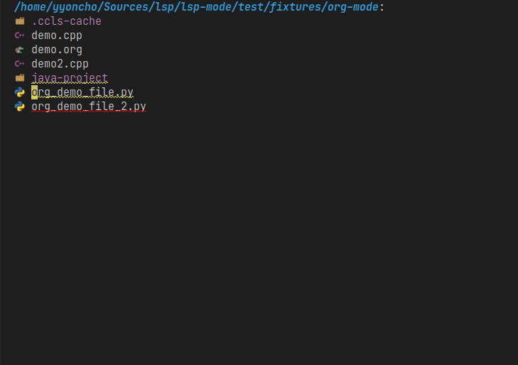

# Dired integration

`lsp-mode` provides integration with `dired` file explorer. `lsp-mode` will show
which files/folders contain errors/warnings/hints. To enable this behaviour add
`(lsp-dired-mode)` call to your config.

## Screenshot

