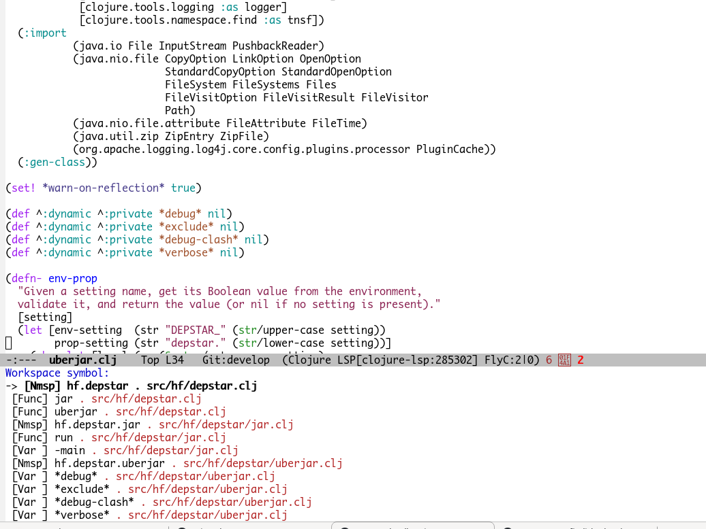

# Ido integration

`lsp-mode` provides integration with `ido` for `workspace-symbol`
command. `lsp-mode` will show all workspace/project symbols using IDO.
To enable this behaviour add `(require 'lsp-ido)` call to your config.

By installing
[ido-completing-read+](https://github.com/DarwinAwardWinner/ido-completing-read-plus)
`lsp-mode` will use IDO for showing candidates on other commands as
well e.g. refactor, code actions, etc.

## Screenshot



## Command

- `lsp-ido-workspace-symbol` command will be available as an interactive call.


## Configuration

You can disable symbol kind and symbol filepath from the candidate
list by changing the following settings

```elisp
(setq lsp-ido-show-symbol-kind nil
      lsp-ido-show-symbol-filename nil)
```
