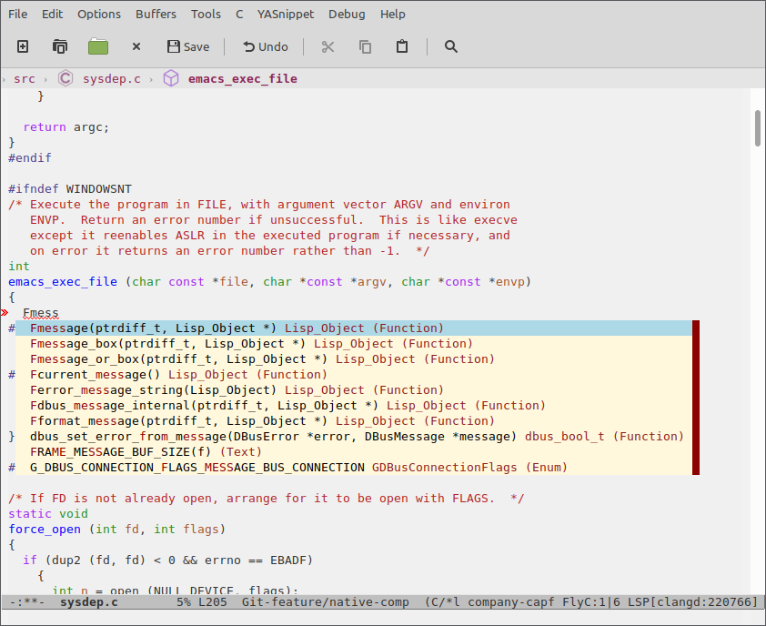
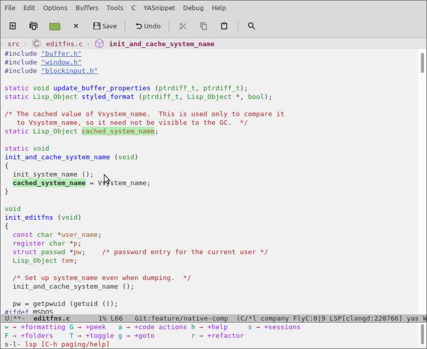
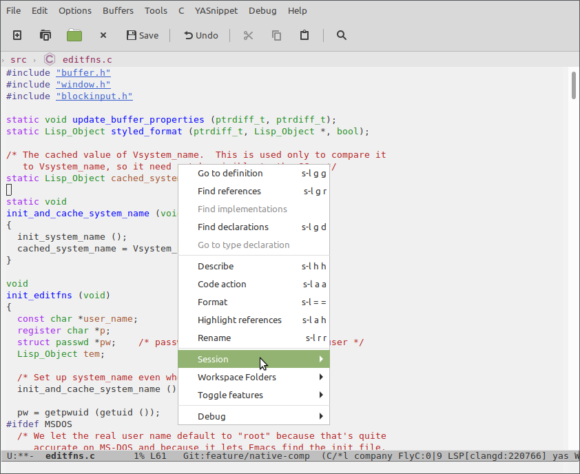
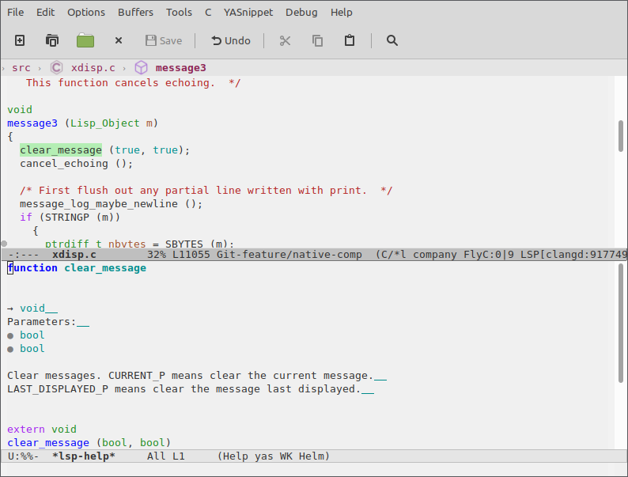
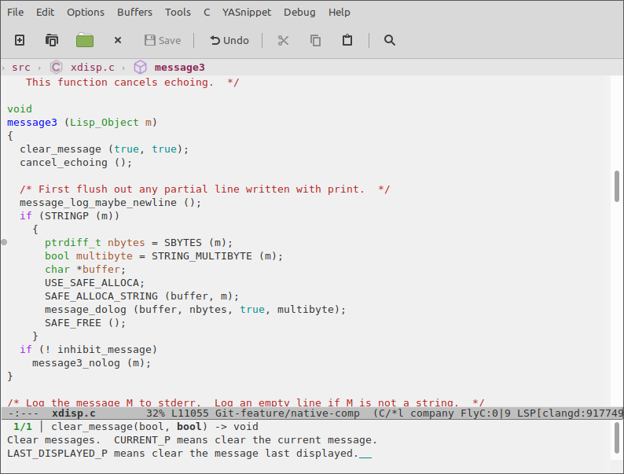
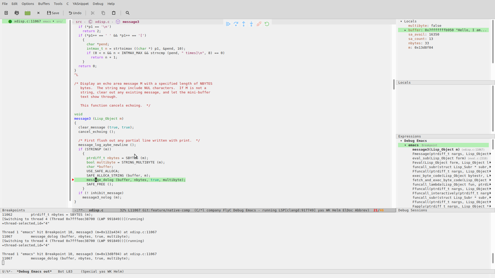

# Configuring `Emacs` a `C/C++` IDE

In this guide, I will show you how to configure `lsp-mode` and `dap-mode` for C/C++ development, using `GNU Emacs` as an example code base. At the end of this tutorial, Emacs should provide you with all the language-aware editor features you'd expect from a modern C++ IDE, such as

* Code completion...
environment. The guide is mainly focused on `lsp-mode`/`dap-mode` and the
features that they have. We will use `GNU Emacs` as a project in order to illustrate each of
the steps to get `C/C++` project up and running.

Some of the main features that we can expect from a C++ IDE:

* Code completion
* Real-time syntax checking
* Code navigation (references/definitions/implementations/symbol search)
* Visual IDE debugger
* Document outline, breadcrumb and modeline widgets

For all `lsp-mode` features, check [here](https://emacs-lsp.github.io/lsp-mode/page/main-features/).

# Obtaining a language server

`lsp-mode` is a client-server application with `Emacs` acting as the client. In
order for it to work, you have to install a separate _language server_ that
understands the specifics of your target language. As of late 2020, there are 2
production-ready language servers for `C/C++` and `Objective-C`,
[ccls](https://github.com/MaskRay/ccls) and
[clangd](https://clangd.llvm.org/installation.html), with `ccls`'s precursor
`cquery` being deprecated. used by `Emacs` as provider for language specific
features (completion, diagnostics, navigation, etc). For some of the language
servers `lsp-mode` ships with automatic installation scripts but there is no
such script for installing `C/C++` language server due to their overall
complexity. For this guide we will be using
`clangd` but most of the steps here apply to `ccls` as well. `lsp-mode` is
pre-configured and it will be able to find the language server automatically
when it is installed on the host machine and it is present on the path. In case
`clangd` is not present on the path `clangd` can be installed following their
[Getting Started](https://clangd.llvm.org/installation.html "Getting Started")
instructions.

_Note:_ for `Debian` based system use https://apt.llvm.org/

## Project setup

To understand your source code, `clangd` needs to know the compiler flags that are used to build the project. (This is
just a fact of life in C++, source files are not self-contained).

By default, `clangd` will assume your code is built as `clang` `some_file.cc`, and
you’ll probably get spurious errors about missing `#included` files, etc. There
are a couple of ways to fix this. You may read about them in [installation](https://clangd.llvm.org/installation.html "clangd installation") or in https://sarcasm.github.io/notes/dev/compilation-database.html.

In order to generate `compile_commands.json` for `Emacs` itself I have found
that [Bear](https://github.com/rizsotto/Bear) works fine.

``` bash
sudo apt-get install bear
```

Setup `Emacs` sources and dependencies:

``` bash
sudo apt-get install -y build-essential git autoconf texinfo libgnutls28-dev libxml2-dev libncurses5-dev libjansson-dev

git clone git://git.sv.gnu.org/emacs.git
cd emacs
./autogen.sh
CFLAGS="-ggdb3 -O0" CXXFLAGS="-ggdb3 -O0" LDFLAGS="-ggdb3" ./configure --with-modules --with-json
bear make -j$(nproc)
```

Prefixing `make -j$(nproc)` with `bear` will generate the
`compile_commands.json` which later will be used by `clangd`. `CFLAGS="-ggdb3
-O0" CXXFLAGS="-ggdb3 -O0" LDFLAGS="-ggdb3"` will compile `Emacs` with debug
symbols.

# lsp-mode configuration

Here is a bare-bones `lsp-mode`/`dap-mode` configuration template to get you started with your own `lsp-mode` config, or to try out in a separate one-off session. Please note that Emacs configuration frameworks such as Spacemacs or Doom Emacs often ship with `lsp-mode` settings of their own; should you be using such a framework, and find that `lsp-mode` doesn't behave as intended, please make sure to follow this tutorial from a clean starting point.
in your config or you could run in separate session.

``` emacs-lisp
(require 'package)
(add-to-list 'package-archives '("melpa" . "http://melpa.org/packages/") t)
(package-initialize)

(setq package-selected-packages '(lsp-mode yasnippet lsp-treemacs helm-lsp
    projectile hydra flycheck company avy which-key helm-xref dap-mode))

(when (cl-find-if-not #'package-installed-p package-selected-packages)
  (package-refresh-contents)
  (mapc #'package-install package-selected-packages))

;; sample `helm' configuration use https://github.com/emacs-helm/helm/ for details
(helm-mode)
(require 'helm-xref)
(define-key global-map [remap find-file] #'helm-find-files)
(define-key global-map [remap execute-extended-command] #'helm-M-x)
(define-key global-map [remap switch-to-buffer] #'helm-mini)

(which-key-mode)
(add-hook 'c-mode-hook 'lsp)
(add-hook 'cpp-mode-hook 'lsp)

(setq gc-cons-threshold (* 100 1024 1024)
      read-process-output-max (* 1024 1024)
      treemacs-space-between-root-nodes nil
      company-idle-delay 0.0
      company-minimum-prefix-length 1
      lsp-idle-delay 0.1 ;; clangd is fast
      ;; be more ide-ish
      lsp-headerline-breadcrumb-enable t)

(with-eval-after-load 'lsp-mode
  (add-hook 'lsp-mode-hook #'lsp-enable-which-key-integration)
  (require 'dap-cpptools)
  (yas-global-mode))
```

# Feature overview

And now it is time to start hacking on `Emacs` core!

```
emacs ~/Sources/emacs/src/editfns.c
```

Now, if everything was successful you will be asked to select a project root.


_Note:_ the project root is needed by the language server in order to know where to
start the project discovery from. Typically, this is the git repository root but since exceptions to this rule have caused us a lot of trouble in the past (monorepos come to mind), `lsp-mode` by default asks the user to manually confirm the project root the first time a project is opened.
mono-repos it might be not. `lsp-mode` by default will ask the user to confirm
the project root (automatic root selection has caused a lot of trouble for us in
the past).

### Completion

By default, `lsp-mode` uses `company-mode` as its completion frontend. When
present, `company-mode` will be auto-configured and it will just work.



### keybindings/`which-key` integration

`lsp-mode` has smart (almost) complete mnemonic keybindings which auto-enable
itself when a certain feature is supported by the server and when the
corresponding `Emacs` package is installed. In addition to that, `lsp-mode`
ships with [which-key](https://github.com/justbur/emacs-which-key "which key url") integration for better discoverability.
By default, `lsp-mode`'s keybindings are available under `s-l` (Super-l), e. g. `s-l h h` will
show documentation at point. You may change the default prefix by setting
`lsp-keymap-prefix`.



### Mouse support
Yeah, `lsp-mode` supports mouse!



### Refactoring/Code actions

- `lsp-rename` (`s-l r r`) - rename symbol/function at point.
- `lsp-execute-code-action` (`s-l a a`) - `clangd` is able to auto-correct some of the errors.

### Navigation
`lsp-mode` has integration with `xref` core package and in addition it has

- `xref-find-definitions`(`M-.` and `s-l g g`) - find definition(s) at point
- `xref-find-references`(`s-l g r`) - find references to the symbol at point

- `helm-imenu` - browse the symbols in current document
- `helm-lsp-workspace-symbol` - find symbol in current project

- `helm-lsp-global-workspaces-symbol` - find symbol in all projects
- `lsp-treemacs-type-hierarchy` - show type hierarchy

_Note:_ if you prefer [ivy](https://github.com/abo-abo/swiper) over `helm` you may check out [lsp-ivy](https://github.com/emacs-lsp/lsp-ivy).

### [lsp-treemacs](https://github.com/emacs-lsp/lsp-treemacs)
`lsp-treemacs` is a package providing integration with
[treemacs](https://github.com/Alexander-Miller/treemacs) and an alternative
tree-view visualization. Refer to the project's readme for further information.


### Help/Documentation
`lsp-mode` automatically enables `eldoc-mode` which will show hover information
in the minibuffer. `lsp-mode` is showing only the one line signature info so if
you want to see the full documentation at point you can use `lsp-describe-thing-at-point`.



In addition to that you can also see signature help after pressing `C-M-SPC` or
after pressing trigger char like `(`. If there is more than one applicable signature due to function overloading, you may browse between the available candidates using `M-n/M-p`.
may browse them via `M-n/M-p`



### Diagnostics
For on-the-fly errors `lsp-mode` is using `flycheck` (`flymake` is also
supported). It is configured automatically. In addition to standard `flycheck`
features `lsp-mode` provides a project-wide error list via
`lsp-treemacs-errors-list`.


## Debugging

Just like `lsp-mode` provides editing features through the editor-independent [Language Server Protocol](https://microsoft.github.io/language-server-protocol/), its sister package `dap-mode` provides debugging features through the editor-independent [Debug Adapter Protocol](https://microsoft.github.io/debug-adapter-protocol/) and language-specific debugging servers called _debug adapters_.
front-end of the sister [Debug Adapter Protocol](https://microsoft.github.io/debug-adapter-protocol/). It is again client server
like `Language Sever Protocol`. `dap-mode` provides all of the traditional
debugger features - breakpoints(conditions, hit count, etc), threads, locals,

### Installation

`dap-mode` provides installation commands for most of the debug adapters. In this
tutorial we will use the [vscode-cpptools](https://github.com/microsoft/vscode-cpptools) debug adapter. To install the adapter
do `M-x dap-cpptools-setup`.

_Note:_ you should have `gdb` on path.

### Creating debug configuration

`dap-mode` introduces the notion of debug configuration and debug template. The
debug configuration is the settings that are needed by the debug adapter to
start the program to debug. Debug template is a template for such configuration
which will be populated by the user or by `dap-mode`. There are two ways to
manage debug configuration - using `emacs lisp` via `dap-debug-edit-template`
and `dap-register-debug-template`. The second way is using `launch.json`. Put it
in project root and `dap-mode` will pick it up.


``` json
{
    "version": "0.2.0",
    "configurations": [
        {
            "name": "Debug Emacs",
            "type": "cppdbg",
            "request": "launch",
            "program": "${workspaceFolder}/src/emacs",
            "args": ["-q"],
            "stopAtEntry": false,
            "cwd": "${workspaceFolder}",
            "environment": [],
            "externalConsole": false,
            "MIMode": "gdb"
        }
    ]
}
```

At this point, `dap-mode` does not provide the list of all available properties
for each configuration. The full list can be found in `package.json` in
`/.emacs.d/.extension/vscode/cpptools/extension/package.json` when `dap-mode` is
using `VScode` package or debug adapter docs when not.

### Debugging

Start debugging via `M-x dap-debug` and select `Debug Emacs` from the list.
.

After pressing `RET` a fresh instance of `Emacs` will pop up. Then do `M-x
helm-lsp-workspace-symbol` and type `message3`. Go to that function and place a
breakpoint. You could do that by clicking in the fringe or by doing `M-x
dap-breakpoint-toggle`. Switch to the debugged instance and do

`M-: (message "Hello, I am debugging Emacs core!") RET`

.
