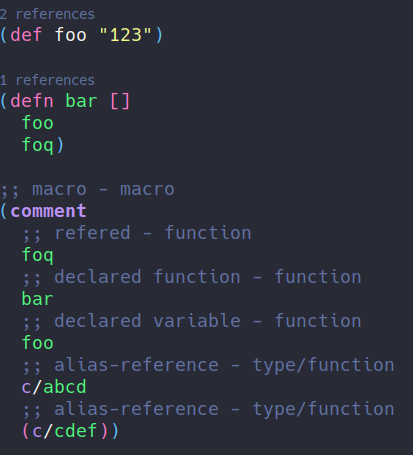

# Configuring `Emacs` as a `Clojure` IDE

In this guide, I will show you how to configure emacs to develop for Clojure
using: 

- `lsp-mode`, which have a lot of IDE features like **completion**, **renaming**
**find-references**, **find-definition**, **code lens**, **code actions**
- [cider](https://github.com/clojure-emacs/cider),
the Emacs package most famous for a Clojure **REPL driven development**. 

## Why should I try LSP for Clojure?

When I started programming for Clojure in Emacs coming from Java world, it was odd to me that 
for almost everything you need to do, **you need a REPL running in your project**, and if you change anything
on it, you would need to reload the namespace/code that was changed to apply changes on your REPL, also I 
missed a lot of features I used to use on my day that works pretty well for Java like cleaning unused imports, 
call hierarchy of a method/function, formatting, real-time syntax checking, and code actions like adding a missing import.
Then I found [clojure-lsp](https://github.com/clojure-lsp/clojure-lsp), which implements most of those features and 
since that, I use it along with `cider` for more than a year without issues. 

I really like `cider` and I think is one of the best tools for Clojure development built indeed,
but that does not mean you cannot use other packages along with it to improve your development.

After `cider` is running (REPL plugged), you can have a lot of those features too so they may conflict, 
like `Find definition` for example, you just need to tell Emacs which one is that you want.

Therefore, if you want to have a more *IDE-ish* experience with Emacs, you should read this guide.

## Basic configuration

Here is a bare-bones `lsp-mode` configuration template to get you started with your own `lsp-mode` config, 
or to try out in a separate one-off session. Please note that Emacs configuration frameworks such as 
**Spacemacs** or **Doom Emacs** often ship with `lsp-mode` settings of their own; should you be using such a framework, 
and find that `lsp-mode` doesn't behave as intended, please make sure to follow this tutorial from a clean starting point.
in your config or you could run in a separate session.

``` emacs-lisp
(require 'package)
(add-to-list 'package-archives '("melpa" . "http://melpa.org/packages/") t)
(package-initialize)

(setq package-selected-packages '(clojure-mode lsp-mode cider yasnippet lsp-treemacs helm-lsp projectile hydra flycheck company avy which-key helm-xref))

(when (cl-find-if-not #'package-installed-p package-selected-packages)
  (package-refresh-contents)
  (mapc #'package-install package-selected-packages))

;; sample `helm' configuration use https://github.com/emacs-helm/helm/ for details
(helm-mode)
(require 'helm-xref)
(define-key global-map [remap find-file] #'helm-find-files)
(define-key global-map [remap execute-extended-command] #'helm-M-x)
(define-key global-map [remap switch-to-buffer] #'helm-mini)

(which-key-mode)
(add-hook 'clojure-mode-hook 'lsp)
(add-hook 'clojurescript-mode-hook 'lsp)
(add-hook 'clojurec-mode-hook 'lsp)

(setq gc-cons-threshold (* 100 1024 1024)
      read-process-output-max (* 1024 1024)
      treemacs-space-between-root-nodes nil
      company-idle-delay 0.0
      company-minimum-prefix-length 1
      lsp-lens-enable t
      lsp-signature-auto-activate nil 
      ; lsp-enable-indentation nil ; uncomment to use cider indentation
      ; lsp-enable-completion-at-point nil ; uncomment to use cider completion
      )

(with-eval-after-load 'lsp-mode
  (add-hook 'lsp-mode-hook #'lsp-enable-which-key-integration)
  (yas-global-mode))
```

For more detailed info on how to setup `lsp-mode`, check [here](https://emacs-lsp.github.io/lsp-mode/page/installation/).

## Installing the language server

`lsp-mode` is a client-server application with `Emacs` acting as the client. In
order for it to work, you have to install a separate _language server_ that
understands the specifics of your target language. 

For Clojure, we will use [clojure-lsp](https://github.com/clojure-lsp/clojure-lsp) which as of 2021/01, is the only [LSP](https://microsoft.github.io/language-server-protocol/implementors/servers/) 
server for Clojure, it has a lot of useful features that I will try to show in this guide.

### Via lsp-mode

`lsp-mode` ships with automatic installation scripts for some of the language servers and clojure-lsp 
is one of the supported servers, you can install it using <kbd>M-x</kbd> `lsp-install-server` <kbd>RET</kbd> `clojure-lsp`. 
After installed, `lsp-mode` will automatically initialize it when opening Clojure files.

### Manually

Check [here](https://github.com/clojure-lsp/clojure-lsp#installation) for more information on how to build it manually.

For a custom path, you can set the path of the server location with:

```elisp
(setq lsp-clojure-custom-server-command '("bash" "-c" "/path/to/clojure-lsp"))
```

## LSP features

`lsp-mode` has a lot of features and integrations, this guide will show the most important ones 
that I think it's important on Clojure development. You can check all the features on the 
official [lsp-mode documentation](https://emacs-lsp.github.io/lsp-mode/)

For more info on `lsp-mode` features, check [here](https://emacs-lsp.github.io/lsp-mode/page/main-features/).

### Syntax check

It checks for errors and warnings on your code while you write it, it uses [clj-kondo](https://github.com/clj-kondo/clj-kondo), 
another amazing library that lints Clojure code, in the back-end so it's not required to install `clj-kondo` since `clojure-lsp` will
use it automatically.

It will also check for public unused functions/variables which is something that, as far as I know, does not exist in 
any other Clojure library/package:


### Find definition/references

You can find a function definition with `lsp-find-definition` or find all the references to that 
symbol, variable or function with `lsp-find-references` or `lsp-ui-peek-find-references` if 
[lsp-ui](https://emacs-lsp.github.io/lsp-ui/) is available. 


<details>
<summary>Doom emacs users</summary>

You may need to remove the lookup handlers conflict from `cider` and/or `clj-refactor` if you want to use this LSP feature.

```elisp
(use-package! cider
  :after clojure-mode
  :config
  (set-lookup-handlers! 'cider-mode nil))
  
(use-package! clj-refactor
  :after clojure-mode
  :config
  (set-lookup-handlers! 'clj-refactor-mode nil))
```

</details>

### Code lens

LSP supports code lens that are texts that server may want to present in client IDE. `clojure-lsp` 
use it for references count of a function/variable, they are disabled by default so you need to manually enable via:

```elisp
(setq lsp-lens-enable t)
```


### Call hierarchy

This is a feature recently introduced in LSP 3.16, which servers should return the call hierarchy of a function/method.
As of now, `clojure-lsp` supports only incoming call hierarchy:


It uses [lsp-treemacs](https://github.com/emacs-lsp/lsp-treemacs) which you should install to use this feature.

### Formatting

For LSP formatting, `clojure-lsp` use [cljfmt](https://github.com/weavejester/cljfmt) with support for all known `cljfmt` 
settings.


### Code actions

One of the most important features considered by me is the **code actions** feature provided by the server. they are refactoring actions
that may change your code after applied, `clojure-lsp` some of the refactorings from below are suggested by the server depending
where user cursor is, for example `Add missing namespace` where `clojure-lsp` will suggest adding a missing require:
  


### Refactorings

`clojure-lsp` also has a lot of refactorings, some of them can be automatically triggered by 
code actions like said above and others manually by user, one example of one of the most 
used by me is `clean-ns`, which will remove any unused requires and refers:


Or `rename` which will rename the symbol at point and all usages/references:


For more info on all available refactorings, check [here](https://github.com/clojure-lsp/clojure-lsp#refactorings).

### Semantic tokens (Experimental)

Another feature recently introduced in LSP 3.16, is **semantic tokens**, which consists of the LSP server return to 
client the tokens and what they mean, with that, `lsp-mode` can color the tokens according to their meaning on the code:



## Performance

For the first time `clojure-lsp` starts in your project, it will scan all jar dependencies and source code, this can 
take a while depending on your project size, after started, it should be really fast and for the next time, it will use its cache and you may not notice any performance issues.

## Server settings

`clojure-lsp` has a lot of settings for improving your development experience, make sure to check it out the [settings](https://github.com/clojure-lsp/clojure-lsp#settings) section.
For an example configuration, check [here](https://github.com/ericdallo/dotfiles/blob/master/.lsp/config.edn).

## CIDER integration

Therefore, it turns out that it's possible to use both `cider` and `lsp-mode` features for a clojure-development, both work 
great together, I rely on `cider` when I really need a REPL, to eval anything, run tests, etc. You can just <kbd>M-x</kbd> `cider-jack-in` and the REPL will start normally.

Author: [@ericdallo](https://github.com/ericdallo)
