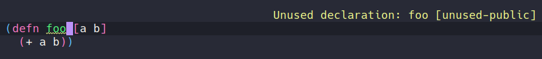
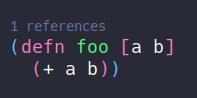
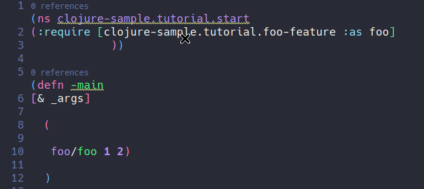
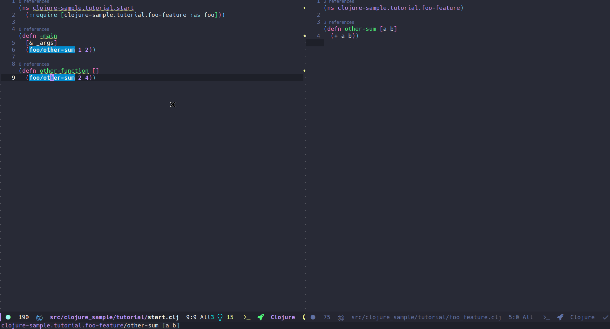
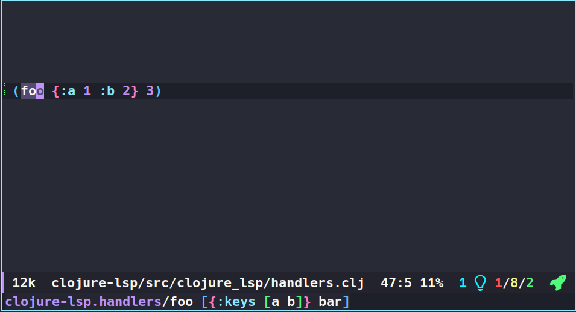

# Configuring `Emacs` as a `Clojure` IDE

Author: [@ericdallo](https://github.com/ericdallo)

In this guide, I will show you how to configure Emacs to develop Clojure
using:

- `lsp-mode`, which has many IDE features like **completion**, **renaming**,
**reference-searching**, **definition-finding**, **code lenses**, **code actions** and many more.
- [CIDER](https://github.com/clojure-emacs/cider),
the Emacs package most famous for enabling **REPL-driven development** with Clojure.

## Why should I try LSP for Clojure?

Coming from the Java world, when I started programming for Clojure in Emacs, it was odd to me that
for almost everything you needed to do with Clojure, **you needed a REPL running in your project**, and if you changed anything
in your project, you would need to reload the modified namespace/code to see the changes in the REPL.
I also
missed a lot of features popularized by Java IDEs, like cleaning unused imports,
viewing the call hierarchy of a method/function, formatting code automatically, checking syntax in real-time, and using code actions that could, for example, add a missing import.
Ever since I found [clojure-lsp](https://github.com/clojure-lsp/clojure-lsp), which implements most of those features, I have been using it alongside `CIDER` without issues.

While I really like `CIDER` and believe it is one of the best tools for Clojure development,
you can complement it with `clojure-lsp` to make programming in Clojure even better.

Once it is running (and you are plugged into the REPL), `CIDER` will provide many of the same features that `clojure-lsp` does, so you need to tell Emacs how to resolve conflicts, which features use from `lsp-mode` and which ones from `CIDER`.

Therefore, if you want to have a more *IDE-ish* experience with Emacs, you should read this guide.

## Basic configuration

Here is a bare-bones `lsp-mode` configuration template to get you started with your own `lsp-mode` config,
or to try out in a separate one-off session. Please note that Emacs configuration frameworks such as
**Spacemacs** or **Doom Emacs** often ship with `lsp-mode` settings of their own; should you be using such a framework,
and find that `lsp-mode` doesn't behave as intended, please make sure to follow this tutorial from a clean starting point.
in your config or you could run in a separate session.

``` emacs-lisp
(require 'package)
(add-to-list 'package-archives '("melpa" . "http://melpa.org/packages/") t)
(package-initialize)

(setq package-selected-packages '(clojure-mode lsp-mode cider lsp-treemacs flycheck company))

(when (cl-find-if-not #'package-installed-p package-selected-packages)
  (package-refresh-contents)
  (mapc #'package-install package-selected-packages))

(add-hook 'clojure-mode-hook 'lsp)
(add-hook 'clojurescript-mode-hook 'lsp)
(add-hook 'clojurec-mode-hook 'lsp)

(setq gc-cons-threshold (* 100 1024 1024)
      read-process-output-max (* 1024 1024)
      treemacs-space-between-root-nodes nil
      company-minimum-prefix-length 1
      ; lsp-enable-indentation nil ; uncomment to use cider indentation instead of lsp
      ; lsp-enable-completion-at-point nil ; uncomment to use cider completion instead of lsp
      )
```

For more detailed info on how to setup `lsp-mode`, check [here](https://emacs-lsp.github.io/lsp-mode/page/installation/).

## Installing the language server

`lsp-mode` is a client-server application with `Emacs` acting as the client. In
order for it to work, you have to install a separate _language server_ that
understands the specifics of your target language.

For Clojure, we will use [clojure-lsp](https://github.com/clojure-lsp/clojure-lsp) which as of 2022/10, is the only [LSP](https://microsoft.github.io/language-server-protocol/implementors/servers/)
server for Clojure, and has a lot of useful features that I will try to show in this guide.

### Via lsp-mode

`lsp-mode` ships with automatic installation scripts for some of the language servers and clojure-lsp
is one of the supported servers, you can install it using <kbd>M-x</kbd> `lsp-install-server` <kbd>RET</kbd> `clojure-lsp`.
After installed, `lsp-mode` will automatically initialize it when opening Clojure files.

### Manually

Check [here](https://github.com/clojure-lsp/clojure-lsp#installation) for more information on how to build it manually.

For a custom path, you can set the path of the server location with:

```elisp
(setq lsp-clojure-custom-server-command '("bash" "-c" "/path/to/clojure-lsp"))
```

## LSP features

This guide will focus on the features of `lsp-mode` that are most relevant to Clojure development. You can view documentation of all features at the
official [lsp-mode site](https://emacs-lsp.github.io/lsp-mode/page/main-features/) or [clojure-lsp features section](https://clojure-lsp.github.io/clojure-lsp/features/).

### Syntax check

It checks for errors and warnings on your code while you write it, it uses [clj-kondo](https://github.com/clj-kondo/clj-kondo),
another amazing library that lints Clojure code, in the back-end so it's not required to install `clj-kondo` since `clojure-lsp` will
use it automatically.

It will also check for public unused functions/variables which is something that, as far as I know, does not exist in
any other Clojure library/package:



### Find definition/references

You can find a function definition with `lsp-find-definition` or find all the references to that
symbol, variable or function with `lsp-find-references` or `lsp-ui-peek-find-references` if
[lsp-ui](https://emacs-lsp.github.io/lsp-ui/) is available.


<details>
<summary>Doom emacs users</summary>

You may need to remove the lookup handlers conflict from `cider` and/or `clj-refactor` if you want to use this LSP feature.

```elisp
(use-package! cider
  :after clojure-mode
  :config
  (set-lookup-handlers! 'cider-mode nil))

(use-package! clj-refactor
  :after clojure-mode
  :config
  (set-lookup-handlers! 'clj-refactor-mode nil))
```

</details>

<details>
<summary>Spacemacs users</summary>

- Add the `dap` layer to the `dotspacemacs/layers ()` section of your `.spacemacs` file (at the top of the file). 
- Require the corresponding module in the `dotspacemacs/user-config ()` section of your `.spacemacs` (at the bottom of the file).
(In my case, I made it work with Chromium.)
- Make sure the Chromium executable is correctly setup (see https://github.com/syl20bnr/spacemacs/issues/13614#issuecomment-1179478365)
 


```elisp
dotspacemacs/user-config()
  ...
  ;; Enable DAP debugging in ClojureScript.
  ;; Trying almost all options...

  ;; This one downloads OK.
  (require 'dap-chrome)

  ;; These two cannot be downloaded... 
  ;; (require 'dap-firefox)
  ;; (require 'dap-node)

  ;; I'm not into trying this one...
  ;; (require 'dap-edge)
```

Based on:
https://emacs-lsp.github.io/lsp-mode/tutorials/debugging-clojure-script/

</details>

### Completion

By default, `lsp-mode` uses `company-mode` as its completion front-end. When
present, `company-mode` and enabled for `lsp-mode`, it will be auto-configured and it will just work using the completion items returned by the LSP server.
`clojure-lsp` also has completion snippets, for more information check [here](https://clojure-lsp.github.io/clojure-lsp/features/#snippets).
If you do not want LSP completion, It's possible to use `cider` completion instead with:

```elisp
(setq lsp-enable-completion-at-point nil) ; use cider completion
```


See also [CIDER code completion](https://docs.cider.mx/cider/usage/code_completion.html)

### Code lens

LSP supports code lenses, actionable text snippets that a server may want to display in a client IDE. `clojure-lsp`
uses it to show the reference count of a function/variable. They are enabled by default so you if you want to disable, disable `lsp-lens-enable` variable:



### Call hierarchy

This feature returns the call hierarchy of a function/method.
As of now, `clojure-lsp` only supports returning the incoming-call hierarchy.


It uses [lsp-treemacs](https://github.com/emacs-lsp/lsp-treemacs), which you should install to use this feature.

### Formatting

For LSP formatting, `clojure-lsp` use [cljfmt](https://github.com/weavejester/cljfmt) with support for all known `cljfmt`
settings.
You can format a region with `lsp-format-region` or the entire buffer with `lsp-format-buffer`.



### Code actions

One of the most important features considered by me is the **code actions** feature provided by the server. they are refactoring actions
that may change your code after applied, `clojure-lsp` some of the refactorings from below are suggested by the server depending
where user cursor is, for example `Add missing namespace` where `clojure-lsp` will suggest adding a missing require:


### Refactorings

`clojure-lsp` also has a lot of refactorings, some of them can be automatically triggered by
code actions like said above and others manually by user, one example of one of the most
used by me is `clean-ns`, which will remove any unused requires and refers:


Or `rename` which will rename the symbol at point and all usages/references:



For more info on all available refactorings, check [here](https://github.com/clojure-lsp/clojure-lsp#refactorings).

<details>
<summary>Conflict with <b>clj-refactor</b> when creating new files</summary>

<b>clj-refactor</b> and <b>clojure-lsp</b> have a feature of add the namespace form for new created files,
but they may conflict if both are enable, inserting duplicated namespace forms. To fix that, you need to choose which one
you wants to use:

To disable this feature on <b>clj-refactor</b>:

```elisp
(setq cljr-add-ns-to-blank-clj-files nil) ; disable clj-refactor adding ns to blank files
```

or to disable on <b>clojure-lsp</b>:

```clojure
;; on your .lsp/config.edn file
{:auto-add-ns-to-new-files? false}
```

</details>

### Hover

This feature shows the function/var signature on minibuffer about the symbol at cursor, it's a really useful feature which avoid the need 
to find definition all the time to check its signature, arity documentation or even clojuredocs for clojure core vars.



<details>
<summary>Conflict with <b>CIDER</b></summary>

<b>clojure-lsp</b> and <b>CIDER</b> have this same feature where it uses <b>eldoc</b> to show the signature on minibuffer and you should choose which one you want enabled during your development. Both work similar but remember that LSP doesn't need the REPL plugged in to work.

To disable this feature on <b>CIDER</b>:

```elisp
(setq cider-eldoc-display-for-symbol-at-point nil) ; disable cider showing eldoc during symbol at point
```

or to disable on <b>clojure-lsp</b>:

```elisp
(setq lsp-eldoc-enable-hover nil) ; disable lsp-mode showing eldoc during symbol at point
```

</details>

### Semantic tokens

Another feature introduced in LSP 3.16, is **semantic tokens**, which consists of the LSP server return to
client the tokens and what they mean, with that, `lsp-mode` can color the tokens according to their meaning on the code:

| semantic-tokens OFF                                   | semantic-tokens ON                                   | CIDER code evaluated                                    |
|-------------------------------------------------------|------------------------------------------------------|---------------------------------------------------------|
|  |  |  |
|                                                       |                                                      |                                                         |

## Performance

For the first time `clojure-lsp` starts in your project, it will scan all jar dependencies and source code, this can
take a while depending on your project size, after started, it should be really fast and for the next time, it will use its cache and you may not notice any performance issues.

## Server settings

`clojure-lsp` has a lot of settings for improving your development experience, make sure to check it out the [settings](https://github.com/clojure-lsp/clojure-lsp#settings) section.
For an example configuration, check [here](https://github.com/ericdallo/dotfiles/blob/master/.lsp/config.edn).

## CIDER integration

We suggest using both `cider` and `lsp-mode` for Clojure development.
I rely on `cider` to use its REPL, evaluate expressions, run tests, and more. You can execute <kbd>M-x</kbd> `cider-jack-in` to start the REPL.

## See also
- [Debugging Clojurescript Tutorial](debugging-clojure-script.md)
