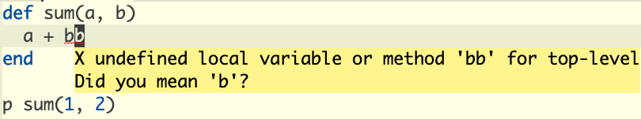

# Configuring `Emacs` as a `Crystal` IDE

Author: [@lanjoni](https://github.com/lanjoni)

In this guide, I'll show you how to configure `lsp-mode` for Crystal development, using `GNU Emacs`. By the end of this tutorial you will be able to use the code editor and all its features for Crystal so far.

For all `lsp-mode` features, check
[here](https://emacs-lsp.github.io/lsp-mode/page/main-features/).

## Installing the language server

`lsp-mode` is a client-server application with `Emacs` acting as the client. In
order for it to work, you have to install a separate _language server_ that
understands the specifics of your target language.

For Crystal, we will be using [crystalline](https://github.com/elbywan/crystalline), which is currently the only [LSP](https://microsoft.github.io/language-server-protocol/implementors/servers/) server for Crystal that is still receiving updates and community support. Previously, [scry](https://github.com/crystal-lang-tools/scry) was used as an LSP server.

### Via lsp-mode

`lsp-mode` ships with automatic installation scripts for some of the language servers and crystal-lsp
is one of the supported servers, you can install it using <kbd>M-x</kbd> `lsp-install-server` <kbd>RET</kbd> `crystal-lsp`.
After installed, `lsp-mode` will automatically initialize it when opening Crystal files.

### Manually

To install manually first make sure the binary is already in your PATH. You can download an already compiled version or compile from the original code with Crystal. Check [here](https://github.com/elbywan/crystalline#installation) for more information on how to build it manually.

After installed, you can add in your settings the definitions to use Crystalline with lsp-mode by default with:

```elisp
(with-eval-after-load 'lsp-mode
  (add-to-list 'lsp-language-id-configuration
               '(crystal-mode . "crystal"))
  (lsp-register-client
  (make-lsp-client :new-connection (lsp-stdio-connection '("crystalline"))
                   :activation-fn (lsp-activate-on "crystal")
                   :priority '1
                   :server-id 'crystalline)))
```

For a custom path, you can set the path of the server location with:

```elisp
(setq lsp-crystal-custom-server-command '("bash" "-c" "/path/to/crystal-lsp"))
```

## LSP features

This guide will focus on the features of `lsp-mode` that are most relevant to Crystal development. You can view documentation of all features at the official [lsp-mode site](https://emacs-lsp.github.io/lsp-mode/page/main-features/) or [crystalline features section](https://github.com/elbywan/crystalline#features).

### Syntax check

This automatically checks your code for errors and warnings as you write it.

There is syntax checking, functions/variables that are not used or do not exist, among other types of checks.



### Formatting

For code formatting, crystal-lsp together with Crystalline provide code formatting following the respective [code conventions (coding style)](https://crystal-lang.org/reference/1.9/conventions/coding_style.html) of the Crystal programming language.

## Performance

The first time `crystal-lsp` starts your project, it will scan all the settings in your `shard.yml` file, which may take a while depending on the size of your project.

## See also
- [Crystal Book](https://crystal-lang.org/reference/1.9/index.html)