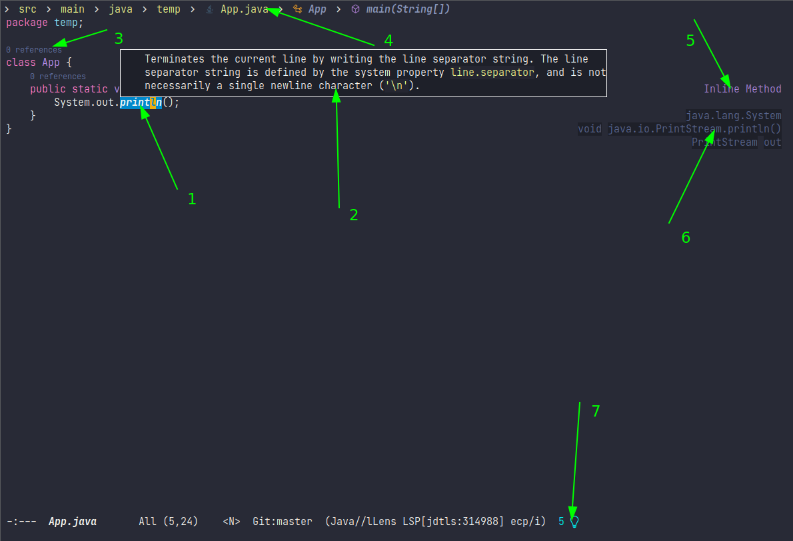
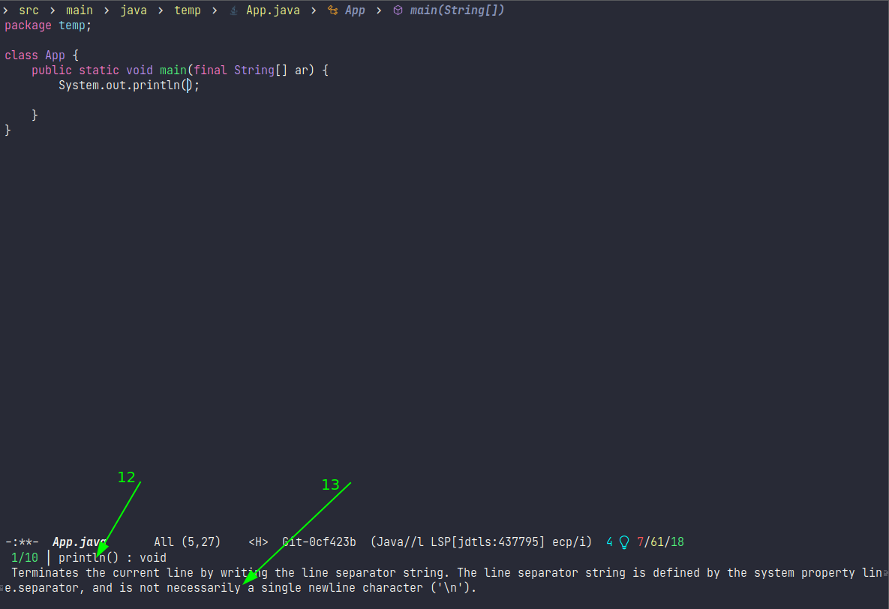
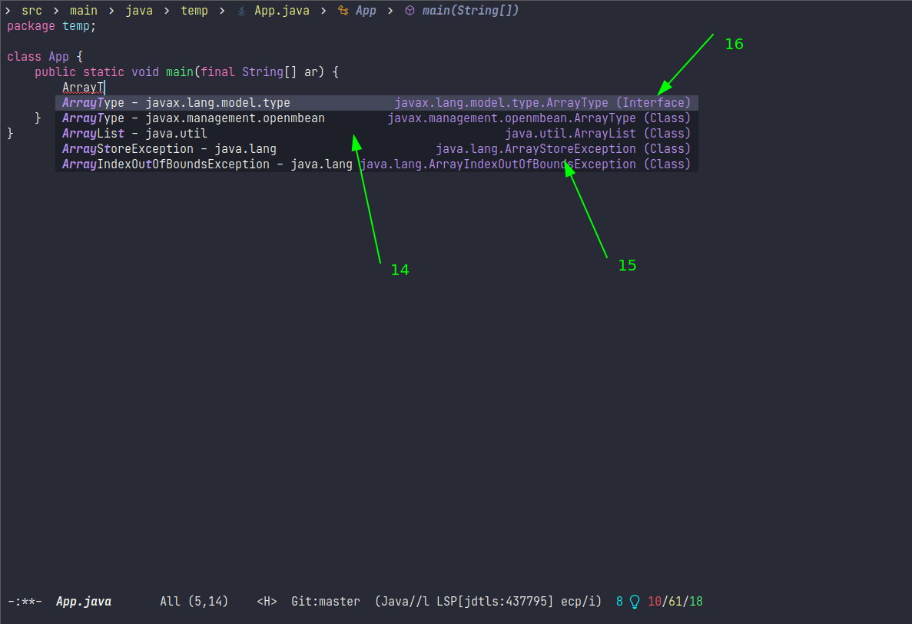

# A guide on disabling/enabling lsp-mode features

Early in the project, we decided to auto-configure/enable all of the stable
features by default in order to improve discoverability and simplify the setup
for the beginners. This decision was considered good by the majority of the
users coming from IDEs but still in `Emacs` community there are a lot of people
looking for a minimal distraction-free experience especially traditional long
time users. Although the turn off `defcustom` settings are documented in
corresponding `README` and available via `customize-group` it turned out that it
is not very easy to find them when you want to turn a particular feature off
which led to a lot of frustration. Hopefully, this article will help solving
that issue:


1. Symbol highlighting
``` elisp
(setq lsp-enable-symbol-highlighting nil)
```
2. `lsp-ui-doc` - on hover dialogs.
* disable via
```
(setq lsp-ui-doc-enable nil)
```
* disable cursor hover (keep mouse hover)
``` elisp
(setq lsp-ui-doc-show-with-cursor nil)
```
* disable mouse hover (keep cursor hover)
``` elisp
(setq lsp-ui-doc-show-with-mouse nil)
```
3. Lenses
``` elisp
(setq lsp-lens-enable nil)
```
4. Headerline
``` elisp
(setq lsp-headerline-breadcrumb-enable nil)
```
5. Sideline code actions
* disable whole sideline via
``` elisp
(setq lsp-ui-sideline-enable nil)
```
* hide code actions
``` elisp
(setq lsp-ui-sideline-show-code-actions nil)
```
6. Sideline hover symbols
* disable whole sideline via
``` elisp
(setq lsp-ui-sideline-enable nil)
```
* hide only hover symbols
``` elisp
(setq lsp-ui-sideline-show-hover nil)
```
7. Modeline code actions
``` elisp
(setq lsp-modeline-code-actions-enable nil)
```

8. `Flycheck` (or `flymake` if no `flycheck` is present)
``` elisp
(setq lsp-diagnostics-provider :none)
```
9. Sideline diagnostics
* disable whole sideline via
``` elisp
(setq lsp-ui-sideline-enable nil)
```
* hide only errors
``` elisp
(setq lsp-ui-sideline-show-diagnostics nil)
```
10. Eldoc
``` elisp
(setq lsp-eldoc-enable-hover nil)
```
11. Modeline diagnostics statistics
``` elisp
(setq lsp-modeline-diagnostics-enable nil)
```

12. Signature help
``` elisp
(setq lsp-signature-auto-activate nil) ;; you could manually requiest them via `lsp-signature-activate`
```
13. Signature help documentation (keep the signatures)
``` elisp
(setq lsp-signature-render-documentation nil)
```

14. Completion (`company-mode`)
``` elisp
(setq lsp-completion-provider :none)
```
15. Completion item detail
``` elisp
(setq lsp-completion-show-detail nil)
```
16. Completion item kind
``` elisp
(setq lsp-completion-show-kind nil)
```
