# Configuring `Emacs` as a `PHP` IDE

Author: [@elken](https://github.com/elken)

In this guide, I will show you how to configure `lsp-mode` and `dap-mode` for
PHP development, using `GNU Emacs` as an example code base. At the end of this
tutorial, Emacs should provide you with all the language-aware editor features
you'd expect from a modern PHP IDE, such as

* Code completion
* Real-time syntax checking
* Code navigation (references/definitions/implementations/symbol search)
* Visual IDE debugger
* Document outline, breadcrumb and modeline widgets

For all `lsp-mode` features, check
[here](https://emacs-lsp.github.io/lsp-mode/page/main-features/).

# Obtaining a language server

`lsp-mode` is a client-server application with `Emacs` acting as the client. In
order for it to work, you have to install a separate _language server_ that
understands the specifics of your target language. 

Currently, there exists several options for an LSP server:

## [Intelephense](https://emacs-lsp.github.io/lsp-mode/page/lsp-intelephense/) (automatic install) 

Considered to be the most stable and recommended choice, but does however
include a freemium model for some of the features.

## [phpactor](https://emacs-lsp.github.io/lsp-mode/page/lsp-phpactor/) (manual install) 
[WIP](https://phpactor.readthedocs.io/en/master/lsp/support.html) fully open
source, but doesn't support the full spec yet

## [Serenata](https://emacs-lsp.github.io/lsp-mode/page/lsp-serenata/) (manual install)

Currently doesn't seem active with no commits since May 2021

## [php-language-server](https://emacs-lsp.github.io/lsp-mode/page/lsp-php/) (manual install) 

No commits since December 2018, considered dead

For the most part, you should be able to pick from at least Intelephense or
phpactor, but for the purpose of this guide we will assume Intelephense.

As expected, for the manual installations you have to follow the instructions
listed on the linked pages.

## Project setup

### Regular composer

For any plain composer projects, it should provide a great experience ootb
unless you're using a complex framework like Laravel or Symfony. Following the
[configuration](#Configuration) instructions linked below should be all you need

### Laravel

For the most part, Laravel should "just work"; with the caveat that the majority
of the so-called "magic methods" won't be autocompleted properly. To get around
this, there is a composer package called
[laravel-ide-helper](https://github.com/barryvdh/laravel-ide-helper) which will
pull together everything in your project and the laravel codebase.

Follow the instructions on the laravel-ide-helper page (including the scripts
changes, so you don't have to regenerate them manually) and add the generated
files to source control ignore files.

# Configuration

Below is a minimal config to get started with LSP & PHP. It includes a couple of
packages to create an IDE-like experience, such as snippets, a project tree
viewer and an autocompletion interface.

For the purposes of demos and screenshots the below config is all that will be
used unless otherwise specified, so you have the confidence that you can easily
replicate everything here.

Also to note that configuration frameworks such as Spacemacs and Doom Emacs
include pre-configured setups for this, so feel free to dig around in those
sources to get some useful snippets!

``` emacs-lisp
(require 'package)
(add-to-list 'package-archives '("melpa" . "http://melpa.org/packages/") t)
(package-initialize)

(setq package-selected-packages '(lsp-mode yasnippet lsp-treemacs flycheck company which-key dap-mode php-mode))

(when (cl-find-if-not #'package-installed-p package-selected-packages)
  (package-refresh-contents)
  (mapc #'package-install package-selected-packages))

(which-key-mode)
(add-hook 'php-mode-hook 'lsp)

(setq gc-cons-threshold (* 100 1024 1024)
      read-process-output-max (* 1024 1024)
      treemacs-space-between-root-nodes nil
      company-idle-delay 0.0
      company-minimum-prefix-length 1
      lsp-idle-delay 0.1)  ;; clangd is fast

(with-eval-after-load 'lsp-mode
  (add-hook 'lsp-mode-hook #'lsp-enable-which-key-integration)
  (require 'dap-php)
  (yas-global-mode))
```

# Feature overview

To reduce the complexity, we won't touch on any frameworks and will instead just
experiment with a simple PHP file.

Also as mentioned above, this will be with Intelephense and a paid licence, so
if you either use the free version or phpactor, your mileage may vary.

To follow along, simply create a PHP file anywhere on your file system (or use
one you have already). For these examples, I'll be using `/tmp/lsp/test.php`.

For starters, let's open our blank file. (emacs-php.el is the contents of the
above snippet on my local file system)

```shell
mkdir -p /tmp/lsp
emacs -Q -l emacs-php.el /tmp/lsp/test.php
```

After opening the file, you should be prompted to install a language server:

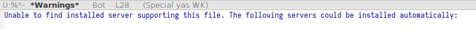

Type "iph" (or tab-complete it) and hit enter. Once your compilation looks
similar to the below, close and reopen emacs and open the file again.

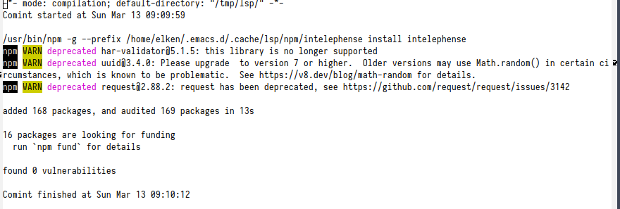

Now, if everything was successful you will be asked to select a project root.

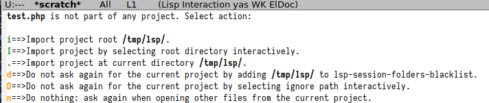

_Note:_ the project root is needed by the language server in order to know where
to start the project discovery from. Typically, this is the git repository root
but since exceptions to this rule have caused us a lot of trouble in the past
(monorepos come to mind), `lsp-mode` by default asks the user to manually
confirm the project root the first time a project is opened.

In this instance, select `i`.

### Completion

By default, `lsp-mode` uses `company-mode` as its completion frontend. When
present, `company-mode` will be auto-configured and it will just work.

For example, after adding a `<?php` at the top of the file, typing "echo" should
populate a list of candidates to select from.

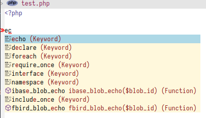

### Refactoring/Code actions

LSP supports a whole suite of actions for codebases, including navigating and
refactoring. Below we will demo a few of these with the following file as a
template.

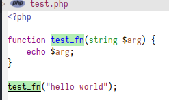

There are a number of ways to perform the below actions, either `M-x` calling
the functions, by using the bound shortcut or by selecting from the mouse menu.

#### Rename

Given a symbol, it's possible to rename all of its references (including in
different files).

With the cursor on `test_fn` (either the declaration or the usage) and invoke
`lsp-rename` (`s-l r r`). Type a new name for the function, and all the usages
should update!

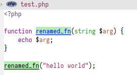

#### Code Actions

Code action support isn't great, in either Intelephense or phpactor. But there
exists a few code actions, for example it's possible to quickly provide a
docblock for a function.

With the cursor on the `test_fn` declaration, invoke `lsp-execute-code-action`
(`s-l a a`). There should now be a simple docblock for the function.


### Navigation
`lsp-mode` has integration with `xref` core package and in addition it has

- `xref-find-definitions`(`M-.` and `s-l g g`) - find definition(s) at point
- `xref-find-references`(`s-l g r`) - find references to the symbol at point
- `lsp-treemacs-type-hierarchy` - show type hierarchy

Depending on which selection framework(s) you use, there should also be packages
available to support it.

For example:

- [helm-lsp](https://github.com/emacs-lsp/helm-lsp)
- [lsp-ivy](https://github.com/emacs-lsp/lsp-ivy)
- [consult-lsp](https://github.com/gagbo/consult-lsp)

### [lsp-treemacs](https://github.com/emacs-lsp/lsp-treemacs)
`lsp-treemacs` is a package providing integration with
[treemacs](https://github.com/Alexander-Miller/treemacs) and an alternative
tree-view visualization. Refer to the project's readme for further information.

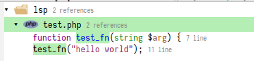

### Help/Documentation
`lsp-mode` automatically enables `eldoc-mode` which will show hover information
in the minibuffer. `lsp-mode` is showing only the one line signature info so if
you want to see the full documentation at point you can use
`lsp-describe-thing-at-point`.

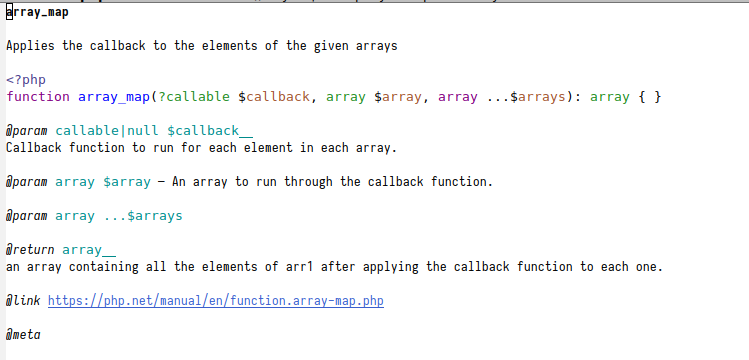

In addition to that you can also see signature help after pressing `C-M-SPC` or
after pressing trigger char like `(`. If there is more than one applicable
signature due to function overloading, you may browse between the available
candidates using `M-n/M-p`.  may browse them via `M-n/M-p`

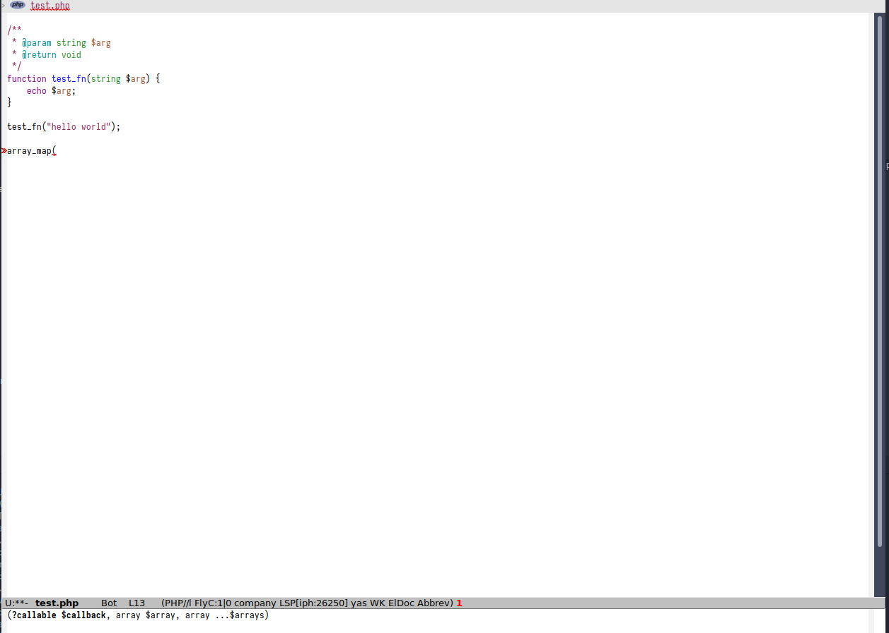

### Diagnostics
For on-the-fly errors `lsp-mode` is using `flycheck` (`flymake` is also
supported). It is configured automatically. In addition to standard `flycheck`
features `lsp-mode` provides a project-wide error list via
`lsp-treemacs-errors-list`.

Depending on which selection framework(s) you use, there should also be packages
available to support it.

For example:

- [helm-lsp](https://github.com/emacs-lsp/helm-lsp)
- [lsp-ivy](https://github.com/emacs-lsp/lsp-ivy)
- [consult-lsp](https://github.com/gagbo/consult-lsp)

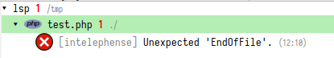

## Debugging

Much like `lsp` is to code navigation/refactoring, there exists a similar spec
called `dap` ([debug adapter protocol](https://microsoft.github.io/debug-adapter-protocol/)) for debugging.
There also exists a sister package for emacs called `dap-mode`.

### Installation

`dap-mode` provides installation commands for most of the debug adapters. In
this tutorial we will use the
[vscode-php-debug](https://github.com/xdebug/vscode-php-debug) debug adapter. 

First ensure that `xdebug` is installed in your PHP config, the following
snippet should check for you:

```shell
php -r "echo (extension_loaded('xdebug') ? 'xdebug up and running' : 'xdebug is not loaded');"
```

Also ensure you follow the instructions
[here](https://github.com/xdebug/vscode-php-debug#installation) for configuring
xdebug correctly. If you have issues with installing xdebug, use the
[wizard](https://xdebug.org/wizard) provided by xdebug to help.

Once it's setup correctly, install the adapter with `M-x dap-php-setup`.

### Creating debug configuration

`dap-mode` introduces the notion of debug configuration and debug template. The
debug configuration is the settings that are needed by the debug adapter to
start the program to debug. Debug template is a template for such configuration
which will be populated by the user or by `dap-mode`. There are two ways to
manage debug configuration - using `emacs lisp` via `dap-debug-edit-template`
and `dap-register-debug-template`. The second way is using `launch.json`. Put it
in project root and `dap-mode` will pick it up.

``` json
{
    "version": "0.2.0",
    "configurations": [
        {
            "name": "PHP Debug",
            "type": "php",
            "request": "launch",
            "program": "${file}",
            "args": ["--server=4711"],
            "cwd": "${workspaceFolder}",
        }
    ]
}
```

### Debugging

Navigate to line 8 and add a breakpoint with `M-x dap-breakpoint-toggle`.

You should also just be able to click inside the gutter on the left.

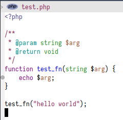.

Start debugging via `M-x dap-debug` and select `PHP Debug` from the list. You
should be presented with a view similar to the below.

.

You can then use the buttons at the top, or `dap-*` commands to step
in/out/over, view locals, add other breakpoints, everything you'd expect from a
visual debugger.

For more usage instructions and more complex setups, please see the dap-mode
[docs](https://emacs-lsp.github.io/dap-mode/).
