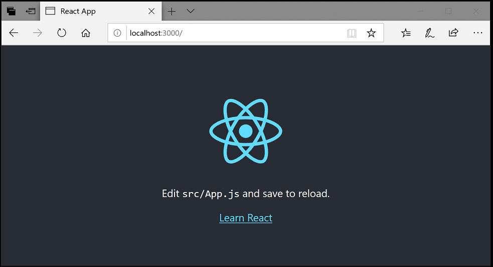
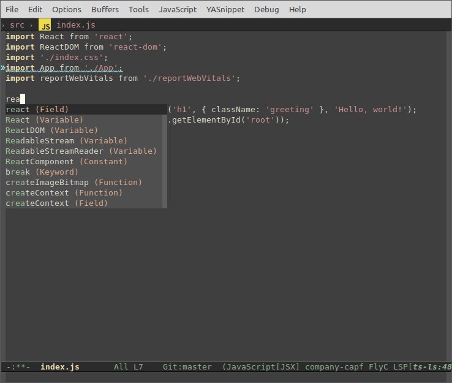
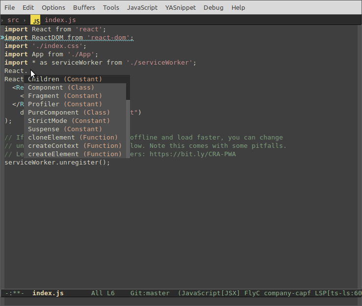
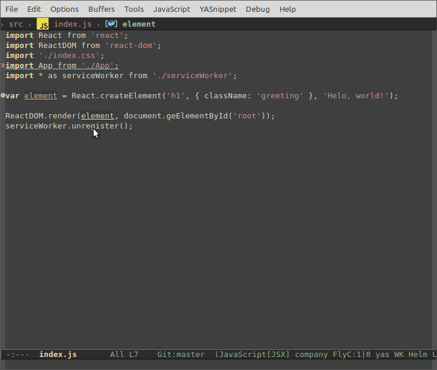
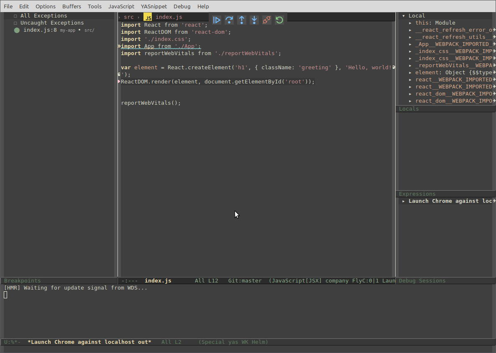
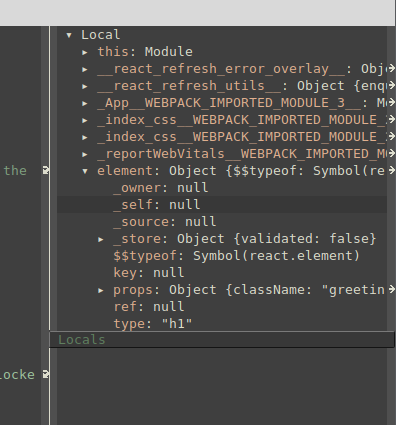
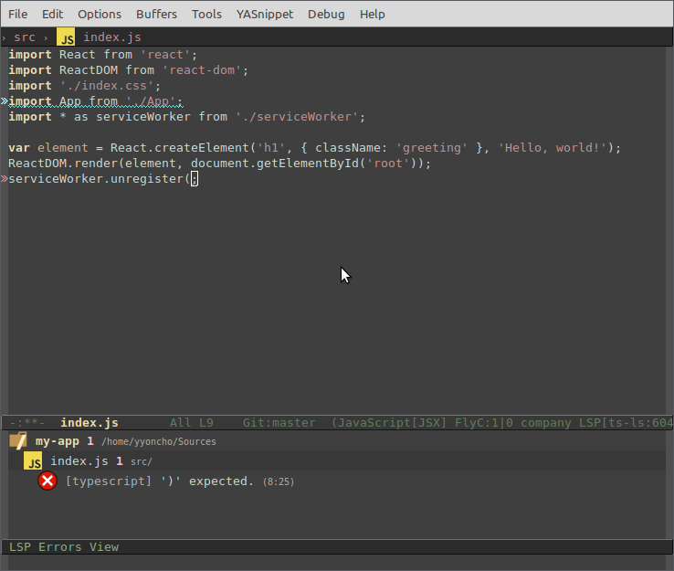
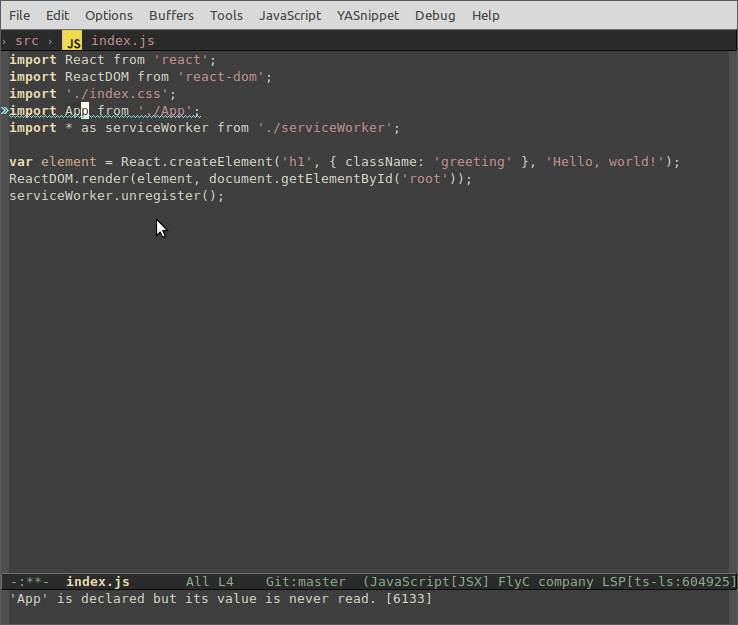

# Using React in Emacs

[React](https://facebook.github.io/react/) is a popular JavaScript library developed by Facebook for building web application user interfaces. The Emacs editor supports React.js IntelliSense and code navigation out of the box.



## Welcome to React

We'll be using the `create-react-app` [generator](https://reactjs.org/docs/create-a-new-react-app.html#create-react-app) for this tutorial. To use the generator as well as to run the React application server, you'll need the [Node.js](https://nodejs.org/) JavaScript runtime and [npm](https://www.npmjs.com/) (Node.js package manager) installed. npm is included with Node.js, which you can download and install from [Node.js downloads](https://nodejs.org/en/download/).

>**Tip**: To test that you have Node.js and npm correctly installed on your machine, you can type `node --version` and `npm --version` in a terminal or command prompt.

You can now create a new React application by typing:

```bash
npx create-react-app my-app
```

where `my-app` is the name of the folder for your React application. It may take a few minutes to create it and to install its dependencies.

>**Note**: If you've previously installed `create-react-app` globally via `npm install -g create-react-app`, we recommend you uninstall the package using `npm uninstall -g create-react-app` to ensure that npx always uses the latest version.

Let's quickly run our React application by navigating to the new folder and typing `npm start` to start the web server and to open the application in a browser:

```bash
cd my-app
npm start
```

>Note: in order to avoid [this issue](https://github.com/eclipse-theia/theia/issues/6720#issuecomment-563488535), you have to add a `jsconfig.json` in the top of the folder:

``` json
{
    "compilerOptions": {
        "module": "commonjs",
        "target": "es2016",
        "jsx": "preserve",
        "allowJs": true,
        "allowSyntheticDefaultImports": true,
        "allowNonTsExtensions": true
    }
}
```

<!-- TBD mention yarn and link -->

You should see the React logo and a link to "Learn React" on [http://localhost:3000](http://localhost:3000) in your browser. We'll leave the web server running while we look at the application with Emacs.

### Emacs configuration

 Here is a minimal configuration to run this tutorial:

``` emacs-lisp
(package-initialize)
(add-to-list 'package-archives '("melpa" . "http://melpa.org/packages/") t)
(setq package-selected-packages '(lsp-mode yasnippet lsp-treemacs helm-lsp projectile hydra flycheck company avy which-key helm-xref dap-mode zenburn-theme json-mode))
(when (cl-find-if-not #'package-installed-p package-selected-packages)
  (package-refresh-contents)
  (mapc #'package-install package-selected-packages))
(load-theme 'zenburn t)
(helm-mode)
(require 'helm-xref)
(define-key global-map [remap find-file] #'helm-find-files)
(define-key global-map [remap execute-extended-command] #'helm-M-x)
(define-key global-map [remap switch-to-buffer] #'helm-mini)
(which-key-mode)
(add-hook 'prog-mode-hook #'lsp)
(setq gc-cons-threshold (* 100 1024 1024)
      read-process-output-max (* 1024 1024)
      company-idle-delay 0.0
      company-minimum-prefix-length 1
      create-lockfiles nil ;; lock files will kill `npm start'
      lsp-headerline-breadcrumb-enable t)
(with-eval-after-load 'lsp-mode
  (require 'dap-chrome)
  (add-hook 'lsp-mode-hook #'lsp-enable-which-key-integration)
  (yas-global-mode))
```

To open your React application in Emacs, open another terminal or command prompt window, navigate to the `my-app` folder and type:

```bash
emacs my-app/src/index.js
```

>**Tip**: For optimal experience use either `Emacs 27.1` or [gccemacs](https://akrl.sdf.org/gccemacs.html).

### Installing the typescript language server

`Emacs` supports automatic language server installation, so the first time you run `M-x lsp` in a JavaScript file opened in it, you will be prompted for a language server to install. Select `ts-ls`.


### Importing the project

Then you have to select project root. Press `i`.


### Syntax highlighting and bracket matching

You'll notice that Emacs has syntax highlighting for the various source code elements and, if you put the cursor on a parenthesis, the matching bracket is also selected.


### IntelliSense

As you start typing in `index.js`, you'll see smart suggestions or completions.



After you select a suggestion and type `.`, you see the types and methods on the object through [IntelliSense](/docs/editor/intellisense.md).



Emacs uses the TypeScript language service for its JavaScript code intelligence and it has a feature called [Automatic Type Acquisition](/docs/nodejs/working-with-javascript.md#typings-and-automatic-type-acquisition) (ATA). ATA pulls down the npm Type Declaration files (`*.d.ts`) for the npm modules referenced in the `package.json`.

If you select a method, you'll also get parameter help:


### Go to Definition, Peek definition

Through the TypeScript language service, Emacs can also provide type definition information in the editor through **Go to Definition** (`M-.`) or **Peek Definition** (`M-x lsp-ui-peek-find-definitions`). Put the cursor over the `App`, right click and select **Go to definition**.

>**Note**: Peek definition requires installing [lsp-ui](https://github.com/emacs-lsp/lsp-ui) package which is not part of the default installation.

## Hello World!

Let's update the sample application to "Hello World!". Add the link to declare a new H1 header and replace the `<App />` tag in `ReactDOM.render` with `element`.

```js
import React from 'react';
import ReactDOM from 'react-dom';
import './index.css';
import App from './App';
import reportWebVitals from './reportWebVitals';

var element = React.createElement('h1', { className: 'greeting' }, 'Hello, world!');
ReactDOM.render(element, document.getElementById('root'));

reportWebVitals();
```

Once you save the `index.js` file, the running instance of the server will update the web page and you'll see "Hello World!".


## Debugging React

To debug the client side React code, we'll need to install the [Debugger for Chrome](https://marketplace.visualstudio.com/items?itemName=msjsdiag.debugger-for-chrome) extension.

>Note: This tutorial assumes you have the Chrome browser installed. There are also debugger extensions for the `Edge` and `Firefox` browsers.

Press `M-x` and type `dap-chrome-setup`.

### Set a breakpoint

To set a breakpoint in `index.js`, click on the gutter to the left of the line numbers. This will set a breakpoint which will be visible as a red circle.



### Configure the Chrome debugger

We need to initially configure the [debugger](https://github.com/emacs-lsp/dap-mode). To do so, create a `launch.json` file in the `.vscode/` subfolder of the project root with a configuration to launch the website:

```json
{
    "version": "0.2.0",
    "configurations": [
        {
            "type": "chrome",
            "request": "launch",
            "name": "Launch Chrome against localhost",
            "url": "http://localhost:3000",
            "webRoot": "${workspaceFolder}"
        }
    ]
}
```

Ensure that your development server is running (`npm start`). Then type `M-x dap-debug` or use `Debug` -> `Start` menu. The source code where the breakpoint is set runs on startup before the debugger was attached, so we won't hit the breakpoint until we refresh the web page. Refresh the page and you should hit your breakpoint.



You can step through your source code using `M-x dap-next`, inspect variables such as `element`, and see the call stack of the client side React application.



The **Debugger for Chrome** extension README has lots of information on other configurations, working with sourcemaps, and troubleshooting. You can review it their [README](https://github.com/microsoft/vscode-chrome-debug)

### Live editing and debugging

If you are using [webpack](https://webpack.js.org/) together with your React app, you can have a more efficient workflow by taking advantage of webpack's HMR mechanism which enables you to have live editing and debugging directly from Emacs. You can learn more in this [Live edit and debug your React apps directly from Emacs(TO BE PORTED TO EMACS)](---) blog post and the [webpack Hot Module Replacement documentation(TO BE PORTED TO EMACS)](---).

## Linting

Linters analyze your source code and can warn about potential problems before running your application. The JavaScript language service included with Emacs has syntax error checking support by default, which you can see in action in the **Errors List** panel (`M-x lsp-treemacs-errors-list`).

Try making a small error in your React source code and you'll see a red squiggle and an error in the **Errors List** panel.



Linters can provide more sophisticated analysis, enforcing coding conventions and detecting anti-patterns. A popular JavaScript linter is [ESLint](https://eslint.org/). ESLint, when combined with the ESLint Emacs [extension](https://emacs-lsp.github.io/lsp-mode/page/lsp-eslint/), provides a great in-product linting experience.

First, install the ESLint command-line tool:

```bash
npm install -g eslint
```

Then install the `ESLint language server` by doing `M-x lsp-install-server RET eslint RET`.

Once the ESLint extension is installed, you'll want to create an ESLint configuration file, `.eslintrc.js`. You can create one using `M-x lsp-eslint-create-default-configuration`.

The command will prompt you to answer a series of questions in a separate window. Accept the defaults, and it will create a `.eslintrc.js` file in your project root that looks something like this:

```js
module.exports = {
    "env": {
        "browser": true,
        "es2020": true
    },
    "extends": [
        "eslint:recommended",
        "plugin:react/recommended"
    ],
    "parserOptions": {
        "ecmaFeatures": {
            "jsx": true
        },
        "ecmaVersion": 11,
        "sourceType": "module"
    },
    "plugins": [
        "react"
    ],
    "rules": {
    }
};
```

`ESLint` will now analyze open files and shows a warning in `index.js` about 'App' being defined but never used.



You can modify the ESLint [rules](https://eslint.org/docs/rules/) in the `.eslintrc.js` file.

Let's add an error rule for extra semi-colons:

```js
 "rules": {
        "no-extra-semi":"error"
    }
```

Now when you mistakenly have multiple semicolons on a line, you'll see an error (red squiggle) in the editor and error entry in the **Problems** panel.


## Popular Starter Kits

In this tutorial, we used the `create-react-app` generator to create a simple React application. There are lots of great samples and starter kits available to help build your first React application.

### TypeScript React

If you're curious about TypeScript and React, you can also create a TypeScript version of the `create-react-app` application. See the details at [TypeScript-React-Starter](https://github.com/microsoft/TypeScript-React-Starter) on the [TypeScript Quick Start](https://www.typescriptlang.org/samples/index.html) site.
